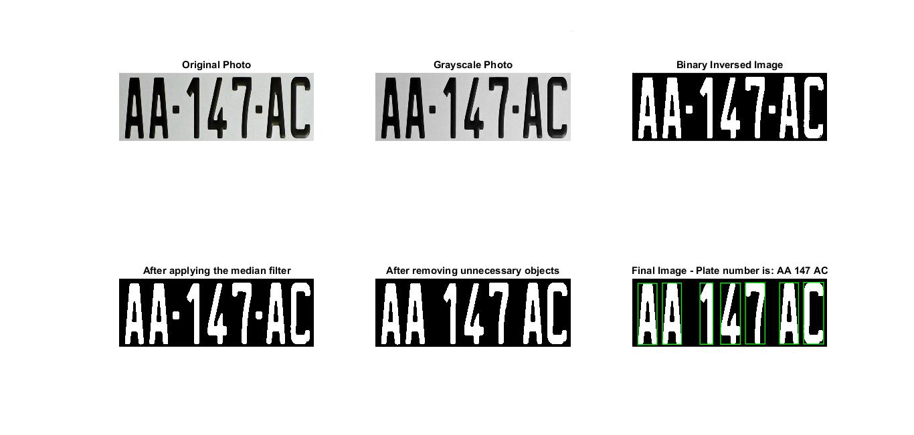

## Automatic Number Plate Recognition

Automatic Number Plate Recognition (ANPR) is a technique employed in the recognition of license plates of vehicles. ANPR has many uses ranging from automated Toll Plaza to security systems. The image processing technique may even be extended to. A camera first detects and captures the snap of the vehicle and then the program searches for the license plate. The algorithm implemented in this report is responsible of segmenting the characters and comparing the
characters for recognition. The system is implemented on MATLAB. The results show that the algorithm successfully extracts and recognizes the number plate and has high performance.

The implemented algorithm starts by importing a plate photo. Then, the algorithm converts the photo to a grayscale image and thus scale it to a binary image. Then, it applies median filter to remove any noise. After that, it applies connected component analysis to detect all connected objects in the photo. Now, the code can handle the detected objects, so it starts to check their sizes. If the size of an object is smaller than a certain value, which is  alculated based on the photo width, the algorithm deletes it. Then, it starts to re-check the objects again and identifies each character using OCR function that is implemented on the Matlab.

Samples of the results:

